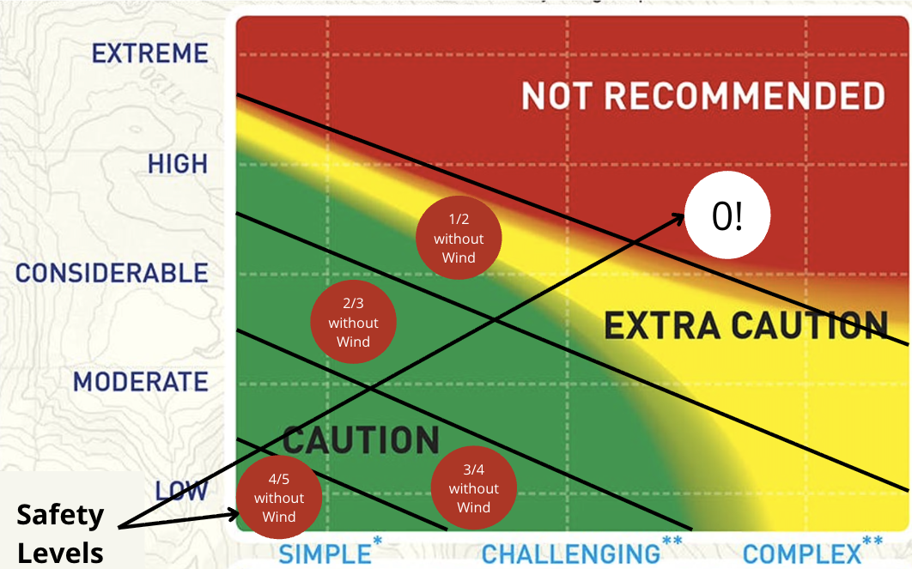

# 📊 Andorra Skimo Bulletin - Rating System Documentation

## Overview

The Andorra Skimo Bulletin uses a sophisticated multi-criteria rating system to evaluate ski-mountaineering routes based on current avalanche conditions. Each route receives four key ratings that combine to provide intelligent route recommendations.

---

## 🏔️ Rating Categories

### 1. **Rating Neu (Snow Quality Rating)** ❄️
**Scale:** 0-5 (5 = Excellent snow conditions)

#### Algorithm Details
```python
def _rating_neu(gruixos, zona_meteo, orientation, start_alt, end_alt):
    # Get snow depths at route start and end altitudes
    start_snow = interpolate_snow_depth(zone, orientation, start_altitude)
    end_snow = interpolate_snow_depth(zone, orientation, end_altitude)

    # If no snow at either end, route is impossible
    if start_snow == 0 or end_snow == 0:
        return 0

    # Rating based on minimum snow depth, capped at 5
    return min(5, ceil(start_snow / 5))
```

#### Snow Depth Interpolation
The system interpolates snow depth based on three official measurement points:
- **1500m elevation:** Base valley measurements
- **2000m elevation:** Mid-altitude measurements
- **2500m elevation:** High altitude measurements

**Linear interpolation formula:**
- Below 1500m: Use 1500m value
- 1500m-2000m: `depth = depth_1500 + (altitude-1500)/500 * (depth_2000-depth_1500)`
- 2000m-2500m: `depth = depth_2000 + (altitude-2000)/500 * (depth_2500-depth_2000)`
- Above 2500m: Use 2500m value

#### Orientation Mapping
- **North aspects (N, NE, NW):** Typically more snow, slower melt
- **South aspects (S, SE, SW, E, W):** Less snow, faster melt

#### Rating Scale
- **5:** Excellent (25+ cm snow depth)
- **4:** Very Good (20-24 cm)
- **3:** Good (15-19 cm)
- **2:** Marginal (10-14 cm)
- **1:** Poor (5-9 cm)
- **0:** Impossible (0-4 cm or no snow)

---

### 2. **Rating Perill (Safety/Danger Rating)** ⚠️
**Scale:** 0-5 (5 = Very safe, 0 = Very dangerous)

#### Algorithm Details
```python
def _rating_perill(zone_data, end_altitude, terrain_type):
    # Get avalanche danger level for the route's end altitude
    danger_level = get_avalanche_danger(zone_data, end_altitude)

    # Apply terrain complexity multiplier
    if terrain_type == "SIMPLE":
        safety_rating = 5 - danger_level
    elif terrain_type == "EXIGENT":
        safety_rating = 5 - (1.5 * danger_level)
    else:  # COMPLEX terrain
        safety_rating = 5 - (2.0 * danger_level)

    return max(0, floor(safety_rating))
```

#### Avalanche Danger Levels (European Scale 1-5)
- **Level 1 (Low):** Generally safe conditions
- **Level 2 (Moderate):** Heightened awareness needed
- **Level 3 (Considerable):** Dangerous conditions
- **Level 4 (High):** Very dangerous conditions
- **Level 5 (Very High):** Avoid avalanche terrain

#### Terrain Complexity Categories (ATES System)
- **SIMPLE:** Non-avalanche terrain, gentle slopes
- **EXIGENT:** Some avalanche terrain, requires route-finding skills
- **COMPLEX:** Complex avalanche terrain, requires advanced skills

#### Altitude-Specific Danger
Many bulletins specify different danger levels above/below a critical altitude:
```
Example: Level 2 above 2300m, Level 1 below 2300m
```

#### Rating Scale Examples
**Simple Terrain:**
- Danger Level 1 → Safety Rating 4 (5-1=4)
- Danger Level 3 → Safety Rating 2 (5-3=2)

**Complex Terrain:**
- Danger Level 1 → Safety Rating 3 (5-2*1=3)
- Danger Level 3 → Safety Rating 0 (max(0, 5-2*3)=0)

---

### 3. **Rating Vent (Wind Exposure Rating)** 🌬️
**Scale:** String indicating problematic wind directions

#### Algorithm Details
```python
def _rating_vent(zone_data, route_orientation):
    route_directions = parse_orientations(route_orientation)
    problematic_directions = zone_data.get("orientacions", [])

    # Find intersection of route aspects with problematic wind directions
    matched_problems = []
    for problem_direction in problematic_directions:
        for route_direction in route_directions:
            if route_direction in problem_direction:
                matched_problems.append(route_direction)

    return "+".join(matched_problems)
```

#### Wind Direction Analysis
The system compares:
1. **Route orientation** (which slopes the route traverses)
2. **Problematic wind directions** from the bulletin

#### Direction Codes
- **N:** North
- **NE:** Northeast
- **E:** East
- **SE:** Southeast
- **S:** South
- **SW:** Southwest
- **W:** West
- **NW:** Northwest

#### Examples
- Route facing "N+E" with problematic winds "N+NE" → Rating: "N"
- Route facing "SW" with no problematic winds → Rating: "" (empty)
- Multi-aspect route "N+S+E" with problems "N+E" → Rating: "N+E"

---

### 4. **Rating Final (Overall Route Score)** 🎯
**Scale:** 0-5 (5 = Highly recommended, 0 = Not recommended)

#### Algorithm Details
```python
def calculate_final_rating(rating_neu, rating_perill, rating_vent):
    # Start with the minimum of snow and safety ratings
    base_rating = min(rating_neu, rating_perill)

    # Wind exposure bonus: 25% boost if no wind problems
    if not rating_vent:  # No wind exposure issues
        base_rating = ceil(base_rating * 1.25)

    # Cap the final rating at 5
    return min(5, base_rating)
```


#### Logic Explanation
1. **Conservative Approach:** Takes the worse of snow and safety conditions
2. **Wind Bonus:** Routes with no wind exposure get a 25% safety boost
3. **Maximum Cap:** No route can exceed perfect score of 5

#### Rating Scale Interpretation
- **5:** Excellent conditions, highly recommended
- **4:** Very good conditions, recommended
- **3:** Good conditions, suitable for experienced
- **2:** Fair conditions, proceed with caution
- **1:** Poor conditions, not recommended
- **0:** Dangerous conditions, avoid

---

## 📈 Route Ranking System

Routes are sorted using a **hierarchical ranking system:**

### Primary Sort: `rating_final` (descending)
The overall recommendation score is the primary factor.

### Secondary Sort: `rating_perill` (descending)
For routes with equal final ratings, prioritize safer routes.

### Tertiary Sort: `rating_neu` (descending)
For routes with equal final and safety ratings, prioritize better snow conditions.

### Quaternary Sort: Wind exposure analysis
Routes with less wind exposure are preferred.

---

## 🎯 Top 3 Recommendations

The "Top 3" section shows the highest-scoring routes after applying the full ranking algorithm. These represent the best combination of:
- ✅ Quantity snow conditions
- ✅ Low avalanche danger
- ✅ Minimal wind exposure
- ✅ Appropriate terrain complexity

---

## 📊 Data Sources

### Primary Data
- **meteo.ad/estatneu:** Official Andorra avalanche bulletins
  - Snow depth measurements at 1500m, 2000m, 2500m
  - Avalanche danger levels by zone and altitude
  - Problematic wind directions and aspects

### Route Data
- **visor.allaus.ad:** ATES terrain classification
  - Route difficulty and terrain complexity
  - Start/end altitudes and orientations
  - Geographic zone assignments

### Update Frequency
- **Bulletins:** Daily at 4:00 PM (Andorra time)
- **Route rankings:** Automatically recalculated with each new bulletin
- **Deployment:** Automated via GitHub Actions at 4:05 PM daily

---

## ⚠️ Safety Disclaimers

**This system provides informational guidance only.**

### Important Limitations
- Ratings are based on general zone conditions, not specific route observations
- Local conditions may vary significantly from zone averages
- Weather can change rapidly in mountain environments
- Route conditions depend on recent weather, not just current bulletins

### Always Remember
- ✅ Check official avalanche bulletins before departing
- ✅ Carry proper avalanche safety equipment
- ✅ Travel with experienced partners
- ✅ Have appropriate mountaineering skills for the terrain
- ✅ Be prepared to turn back if conditions deteriorate

**The mountains are the final authority on safety.**

---

## 🔧 Technical Implementation

### File Structure
```
data/
├── butlleti_YYYY_MM_DD.csv    # Daily route ratings
├── routes.csv                 # Route catalog with ATES data
└── butlleti_allaus.json      # Raw bulletin data

scripts/
├── scrapper_meteo_allaus.py   # Bulletin data extraction
└── generate_butlleti_csv.py   # Rating calculation engine
```

### Rating Calculation Pipeline
1. **Extract** fresh bulletin data from meteo.ad
2. **Parse** snow depths, danger levels, wind conditions
3. **Load** route catalog with terrain classifications
4. **Calculate** individual ratings for each route
5. **Generate** ranked CSV file for web application
6. **Deploy** updated rankings to live website

This systematic approach ensures reliable, repeatable route assessments based on official avalanche safety data.